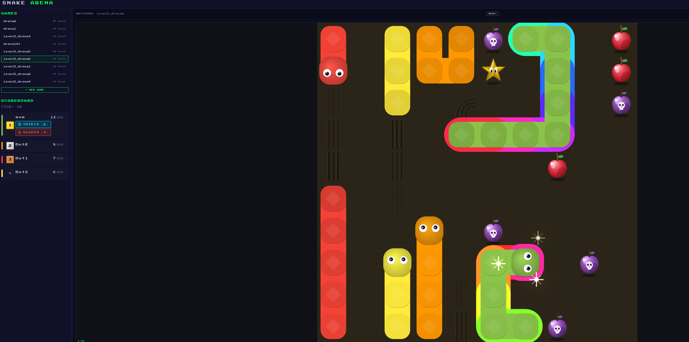

# 🐍 Autonomous Snake AI Client — Itestra Hackathon

Welcome to the **itestra_hack** repository. This project features two parallel implementations—one in **Java 17 (Maven)** and one in **Python 3.10+**—of an autonomous, decision-making agent built to compete in a real-time, competitive Snake multi-player ecosystem.

The system communicates seamlessly with a localized game engine backend via HTTP REST/WebSocket calls, parsing complex grid configurations, tracking item spawns, and deploying pathfinding algorithms under tight millisecond execution windows.

## Demo Game 


---

## 🗺️ Project Architecture Overview

```text
itestra_hack/
├── release/                  # Game Engine Assets
│   ├── Dockerfile            # Container definition for the backend
│   └── server                # Compiled backend core executable
├── static_gui/               # Live match visualizer (HTML5 / JS Engine)
├── SnakeJavaClient/          # Java Client Environment
│   ├── src/main/java/        # Client.java, Snake.java algorithm cores
│   └── pom.xml               # Maven builds & JSON parsing structures
├── SnakePythonClient/        # Python Client Environment
│   └── src/                  # Field.py state machine, path discovery logic
└── README.md                 # Project Documentation

```

---

## ⚙️ The Backend & Network Loop

The engine runs as a standalone server package found within the `release/` folder. It sets up a high-performance, ticking grid space where game cycles advance automatically.

Each tick, the clients must process an incoming packet describing the map layout, other active adversarial snakes, walls, and items (Swords, Stars, Apples).

### Core API Flow

1. **Handshake:** Client registers a session with the game engine server using an initialization request.
2. **State Updates:** The client receives spatial coordinates of obstacles, hazards, and rewards.
3. **Command Payload:** The client's internal pathfinding engine evaluates the safest and highest-reward move, firing back a fast direction control signal (`UP`, `DOWN`, `LEFT`, `RIGHT`).

---

## 🧠 Algorithmic Strategy

Our clients utilize a tiered approach to clear levels and maximize game time:

* **Primary Pathfinding:** Evaluates current target vectors (prioritizing high-value targets like apples or defensive items).
* **Collision Matrix Processing:** Dynamically evaluates grid cells to project next-turn positions of walls and enemy entities.
* **Survival Space Maximization:** When trapped or cut off, the snake transitions into a fallback cycle, computing the largest open available pocket area to buy computational time until paths clear.

---

## 🚀 Client Deployment Guides

Ensure your underlying local development environment has **JDK 17+**, **Maven**, and **Python 3.10+** globally exposed.

### ☕ Deploying the Java Client

The Java infrastructure uses Apache Maven to manage object serialization and network layers.

1. **Navigate to Environment**
Move into the dedicated Java working directory:

```bash
   cd SnakeJavaClient

```

2. **Compile Production Artifacts**
Clean target directories and compile a production-ready standalone executable package:

```bash
   mvn clean package

```

3. **Execute Runnable Client**
Fire up the built binary to automatically pair with your local runner instance:

```bash
   mvn exec:java -Dexec.mainClass="Client" -Dexec.args="<Team Name (mvm)> <GameName> <Password> <Host IP:Port>"

```

---

### 🐍 Deploying the Python Client

The Python stack relies on clean separation via environments for real-time operations.

1. **Navigate to Environment**
Move into the dedicated Python project workspace:

```bash
   cd SnakePythonClient

```

2. **Isolate Virtual Sandbox**
Initialize and lock down a clean target local execution space:

```bash
   python -m venv .venv
   source .venv/bin/activate

```

3. **Install Application Dependencies**
Install required operational tools (if present):

```bash
   pip install -r requirements.txt

```

4. **Boot Client Orchestrator**
Launch the core operational strategy pipeline tracking framework:

```bash
   python ./src/ffafinale.py <Team Name (mvm)> <GameName> <Password> <Host IP:Port>

```

